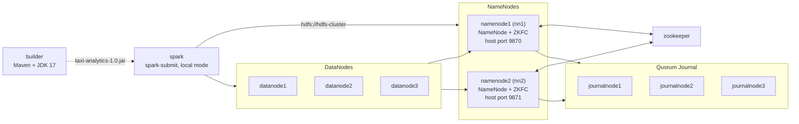

# NYC Taxi Analytics on HA HDFS and Spark

This project runs a highly available HDFS cluster in Docker and uses a Java Spark job to analyze New York City yellow taxi trips stored in it. The job reads the trip records (Parquet) and the taxi zone lookup table (CSV) from HDFS, answers four questions with the Spark `Dataset` API, and writes each answer back to HDFS as Parquet.

Everything runs inside containers. The job reads and writes only HDFS URIs under the logical nameservice `hdfs://hdfs-cluster`, so it keeps working when the active NameNode changes.

Kasra Siavashpour and Ardalan Siavashpour built this together as a course assignment.

## Contents

- [Assignment requirements](#assignment-requirements)
- [Architecture](#architecture)
- [Requirements](#requirements)
- [Quick start](#quick-start)
- [Step by step](#step-by-step)
- [HDFS paths](#hdfs-paths)
- [The Spark job](#the-spark-job)
- [Looking at the results](#looking-at-the-results)
- [Testing failover](#testing-failover)
- [Stopping and cleaning up](#stopping-and-cleaning-up)
- [Project layout](#project-layout)
- [Troubleshooting](#troubleshooting)
- [Authors](#authors)

## Assignment requirements

Here is what the assignment asked for and where each part lives in the repository.

| Requirement | Where |
|---|---|
| HDFS with HA: two NameNodes (active and standby), several DataNodes, JournalNodes, ZooKeeper | `docker-compose.yaml`, `hadoop/`, `scripts/init-ha.sh` |
| Spark in its own container | `spark` service in `docker-compose.yaml` |
| Services talk over an internal Docker network | `hdfs-net` bridge network |
| HDFS web UI on port 9870 | `namenode1` publishes 9870 (`namenode2` is on 9871) |
| A logical HDFS URI, used by the Spark job | `hdfs://hdfs-cluster`, set in `core-site.xml` and passed to the job in `scripts/run-jobs.sh` |
| Upload the Parquet and CSV files to `/data/taxi/` with the CLI inside a container | `scripts/put-data.sh` |
| Analysis in Java with the `Dataset` API, one Parquet output per question under `/output/` | `spark-app/src/main/java/org/bigdata/taxi/TaxiAnalytics.java` |
| A document with the exact commands and HDFS paths | This README ([Step by step](#step-by-step), [HDFS paths](#hdfs-paths)) and `COMMANDS.md` |

## Architecture



All containers share one bridge network, `hdfs-net`, and reach each other by hostname. Only the two NameNode web UIs are published to the host.

| Service | Image | Role |
|---|---|---|
| `zookeeper` | `zookeeper:3.8` | Leader election for the two failover controllers (ZKFC). |
| `journalnode1`, `journalnode2`, `journalnode3` | `apache/hadoop:3` | Quorum Journal Manager. Holds the shared edit log that the standby NameNode replays. |
| `namenode1`, `namenode2` | `apache/hadoop:3` | Active and standby NameNode (`nn1` and `nn2`). Each container also runs a ZKFC, which promotes the standby when the active one goes away. |
| `datanode1`, `datanode2`, `datanode3` | `apache/hadoop:3` | Block storage. The default replication factor of 3 puts a copy of every block on each DataNode. |
| `builder` | `maven:3.9-eclipse-temurin-17` | Builds the Spark job with Maven. |
| `spark` | `bitnami/spark:3.5` | Runs `spark-submit` against HDFS. Has its own Java runtime. |

The JournalNodes run their daemon as the container's main process, so they come up with `docker compose up`. The NameNode and DataNode containers start idle (`tail -f /dev/null`), and `scripts/init-ha.sh` starts the HDFS daemons inside them in the right order.

Each NameNode, JournalNode and DataNode keeps its data in a named Docker volume (`nn1`, `nn2`, `jn1` to `jn3`, `dn1` to `dn3`), so the file system survives container restarts.

### Hadoop configuration

The files in `hadoop/` are mounted into every Hadoop container and into the Spark container at `/opt/hadoop/etc/hadoop`, and `HADOOP_CONF_DIR` points there. That's how the Spark container resolves `hdfs://hdfs-cluster`.

`core-site.xml`:

| Property | Value |
|---|---|
| `fs.defaultFS` | `hdfs://hdfs-cluster` |
| `ha.zookeeper.quorum` | `zookeeper:2181` |
| `io.file.buffer.size` | `131072` |

`hdfs-site.xml`:

| Property | Value |
|---|---|
| `dfs.nameservices` | `hdfs-cluster` |
| `dfs.ha.namenodes.hdfs-cluster` | `nn1,nn2` |
| `dfs.namenode.rpc-address.hdfs-cluster.nn1` / `.nn2` | `namenode1:9820` / `namenode2:9820` |
| `dfs.namenode.http-address.hdfs-cluster.nn1` / `.nn2` | `namenode1:9870` / `namenode2:9870` |
| `dfs.namenode.shared.edits.dir` | `qjournal://journalnode1:8485;journalnode2:8485;journalnode3:8485/hdfs-cluster` |
| `dfs.client.failover.proxy.provider.hdfs-cluster` | `ConfiguredFailoverProxyProvider` |
| `dfs.ha.automatic-failover.enabled` | `true` |
| `dfs.ha.fencing.methods` | `shell(/bin/true)` |
| `dfs.permissions.enabled` | `false` |
| `dfs.namenode.name.dir`, `dfs.journalnode.edits.dir`, `dfs.datanode.data.dir` | `/opt/hadoop/dfs/name`, `/opt/hadoop/dfs/journal`, `/opt/hadoop/dfs/data` |

Clients connect to the nameservice `hdfs-cluster` instead of a NameNode hostname. The failover proxy provider tries `nn1` and `nn2` until it finds the active one.

Fencing is a no-op shell command because there's no SSH between containers. That's fine for a local demo, but a real cluster needs actual fencing so that two NameNodes can never both write. Permissions are off so the `root` user in the Spark container can write to `/output` without any setup.

### Ports

| Port | Where | What |
|---|---|---|
| 9870 | host, mapped to `namenode1:9870` | NameNode web UI for `nn1` |
| 9871 | host, mapped to `namenode2:9870` | NameNode web UI for `nn2` |
| 9820 | internal | NameNode RPC (what `hdfs://hdfs-cluster` resolves to) |
| 8485 | internal | JournalNode RPC |
| 2181 | internal | ZooKeeper. Not published, to avoid clashing with a local ZooKeeper. |

## Requirements

- Docker with the Compose v2 plugin (`docker compose`, not `docker-compose`)
- About 6 to 8 GB of memory for Docker
- A few GB of disk for the images, plus the data
- Network access to Docker Hub for the four images, and to the NYC TLC site for the data

Every service is pinned to `linux/amd64`. On an ARM machine such as an Apple Silicon Mac, Docker runs them under emulation, which works but is slower.

> Bitnami removed `bitnami/spark:3.5` from Docker Hub in 2025. If `docker compose up` can't pull it, see [Troubleshooting](#troubleshooting).

## Quick start

```bash
# 1. start the containers
docker compose up -d

# 2. format (first run only) and start HDFS with automatic failover
bash scripts/init-ha.sh

# 3. download the data into ./data and upload it to HDFS
mkdir -p data
curl -L -o data/yellow_tripdata_2024-01.parquet https://d37ci6vzurychx.cloudfront.net/trip-data/yellow_tripdata_2024-01.parquet
curl -L -o data/taxi_zone_lookup.csv https://d37ci6vzurychx.cloudfront.net/misc/taxi_zone_lookup.csv
bash scripts/put-data.sh

# 4. build the Spark job and run it
bash scripts/run-jobs.sh
```

Run all of these from the repository root. The scripts call `docker compose`, which looks for `docker-compose.yaml` in the current directory.

The next section shows the commands inside each script and how to check that each step worked.

## Step by step

### 1. Start the containers

```bash
docker compose up -d
docker compose ps
```

You should see 11 containers: `zookeeper`, three JournalNodes, two NameNodes, three DataNodes, `builder` and `spark`. The Compose project is named `nyc-taxi-ha`, so the containers are called `nyc-taxi-ha-namenode1-1` and so on.

### 2. Initialize and start HDFS

```bash
bash scripts/init-ha.sh
```

The script runs these commands, in this order, through `docker compose exec`:

| Step | Container | Command |
|---|---|---|
| Format the namespace, first run only (skipped if `/opt/hadoop/dfs/name/current/VERSION` exists). This also formats the shared edit log on the JournalNodes. | `namenode1` | `hdfs namenode -format -force` |
| Start the first NameNode | `namenode1` | `hdfs --daemon start namenode` |
| Initialize the shared edits (errors ignored) | `namenode1` | `hdfs namenode -initializeSharedEdits -force` |
| Copy the namespace to the standby, first run only | `namenode2` | `hdfs namenode -bootstrapStandby -force` |
| Start the second NameNode | `namenode2` | `hdfs --daemon start namenode` |
| Create the failover znode in ZooKeeper (errors ignored) | `namenode1` | `hdfs zkfc -formatZK -force` |
| Start a failover controller next to each NameNode | `namenode1`, `namenode2` | `hdfs --daemon start zkfc` |
| Start the DataNodes | `datanode1` to `datanode3` | `hdfs --daemon start datanode` |
| Print the HA state | `namenode1` | `hdfs haadmin -getServiceState nn1` and `nn2` |

At the end, one NameNode should report `active` and the other `standby`. Which one wins the first election can vary.

Check the cluster:

```bash
docker compose exec -T namenode1 bash -lc '
  hdfs haadmin -getServiceState nn1
  hdfs haadmin -getServiceState nn2
  hdfs dfsadmin -report | head -n 20
'
```

`dfsadmin -report` should list 3 live DataNodes. You can also open the web UIs:

- http://localhost:9870 for `nn1`
- http://localhost:9871 for `nn2`

The overview page shows whether that NameNode is active or standby, and the Datanodes tab lists the three DataNodes.

After a full restart of the stack (`docker compose down` then `up -d`, or a Docker restart), the NameNode and DataNode daemons don't start by themselves. Run `scripts/init-ha.sh` again. It sees that both NameNodes are already formatted and only starts the daemons.

### 3. Download and upload the data

The job needs two files from the [NYC TLC trip record data page](https://www.nyc.gov/site/tlc/about/tlc-trip-record-data.page):

- `yellow_tripdata_<YYYY-MM>.parquet`: one month of yellow taxi trips, one row per trip. January 2024 is about 50 MB and 3 million rows.
- `taxi_zone_lookup.csv`: maps each `LocationID` to a `Borough`, `Zone` and `service_zone`.

The column definitions are in the data dictionary on the same TLC page.

```bash
mkdir -p data
curl -L -o data/yellow_tripdata_2024-01.parquet https://d37ci6vzurychx.cloudfront.net/trip-data/yellow_tripdata_2024-01.parquet
curl -L -o data/taxi_zone_lookup.csv https://d37ci6vzurychx.cloudfront.net/misc/taxi_zone_lookup.csv
```

Any other month works too. You can put more than one month in `./data`, but the TLC has changed some column types over the years, so months from different years may not read together.

Then upload:

```bash
bash scripts/put-data.sh
```

`./data` is mounted read-only into `namenode1` at `/data/host`. The script uploads it from inside that container with the HDFS CLI:

```bash
docker compose exec -T namenode1 bash -lc '
  hdfs dfs -mkdir -p /data/taxi
  hdfs dfs -put -f /data/host/* /data/taxi/
  hdfs dfs -ls -R /data/taxi
'
```

Check the upload and where the blocks landed:

```bash
docker compose exec -T namenode1 bash -lc '
  hdfs dfs -ls -h hdfs://hdfs-cluster/data/taxi
  hdfs fsck /data/taxi -files -blocks -locations
'
```

`./data` is in `.gitignore`, so the data files are never committed.

### 4. Build and run the Spark job

```bash
bash scripts/run-jobs.sh
```

First the script builds the job in the `builder` container. `./spark-app` is mounted at `/workspace`, so the jar ends up in `spark-app/target/` on the host:

```bash
docker compose exec -T builder bash -lc 'mvn -q -e -DskipTests package'
```

Then it runs the job in the `spark` container, where `./spark-app` is mounted at `/opt/spark-app`:

```bash
docker compose exec -T spark bash -lc '
  export HADOOP_CONF_DIR=/opt/hadoop/etc/hadoop
  /opt/bitnami/spark/bin/spark-submit \
    --master "local[*]" \
    --class org.bigdata.taxi.TaxiAnalytics \
    /opt/spark-app/target/taxi-analytics-1.0.jar \
    "hdfs://hdfs-cluster/data/taxi/yellow_tripdata*.parquet" \
    hdfs://hdfs-cluster/data/taxi/taxi_zone_lookup.csv \
    hdfs://hdfs-cluster/output
'
```

Finally it lists what the job wrote:

```bash
docker compose exec -T namenode1 bash -lc 'hdfs dfs -ls -R /output'
```

Spark runs in local mode (`local[*]`), so the driver and executors live in the `spark` container and use all its cores. The data is still read from and written to HDFS through the DataNodes.

## HDFS paths

| | Path |
|---|---|
| Trips (input) | `hdfs://hdfs-cluster/data/taxi/yellow_tripdata*.parquet` |
| Zones (input) | `hdfs://hdfs-cluster/data/taxi/taxi_zone_lookup.csv` |
| Q1 (output) | `hdfs://hdfs-cluster/output/q1_long_trips.parquet` |
| Q2 (output) | `hdfs://hdfs-cluster/output/q2_avg_fare_by_zone.parquet` |
| Q3 (output) | `hdfs://hdfs-cluster/output/q3_revenue_by_borough.parquet` |
| Q4 (output) | `hdfs://hdfs-cluster/output/q4_max_tip_per_day.parquet` |

Each output is a directory of Parquet part files plus a `_SUCCESS` marker, which is how Spark writes Parquet.

## The Spark job

The job is one class, [`TaxiAnalytics.java`](spark-app/src/main/java/org/bigdata/taxi/TaxiAnalytics.java), built with Java 17 against Spark 3.5.1 (Scala 2.12). The Spark dependencies are `provided`, so the jar is only a few kilobytes and uses the Spark that's installed in the container.

It takes three arguments:

```
TaxiAnalytics <tripsParquetPath> <zonesCsvPath> <outputBase>
```

### Reading and preparing the data

```java
Dataset<Row> trips = spark.read().parquet(tripsPath);
Dataset<Row> zones = spark.read().option("header", "true").csv(zonesPath);
```

The job casts the columns it uses to fixed types, so the queries behave the same whatever types a particular month's file uses:

| Column | Type |
|---|---|
| `tpep_pickup_datetime`, `tpep_dropoff_datetime` | timestamp |
| `passenger_count`, `PULocationID`, `DOLocationID` | int |
| `trip_distance`, `fare_amount`, `total_amount`, `tip_amount` | double |
| `LocationID` (zones) | int |

The zone CSV is read with a header and no schema inference, so every column starts as a string. Only `LocationID` needs to be cast for the joins.

### Q1: long trips with more than two passengers

Keeps the trips with `passenger_count > 2` and `trip_distance > 5`, adds a `duration_minutes` column and sorts the longest trips first.

```java
Column durationMinutes = expr(
    "(unix_timestamp(tpep_dropoff_datetime) - unix_timestamp(tpep_pickup_datetime)) / 60.0");
Dataset<Row> q1 = trips
        .filter(col("passenger_count").gt(2).and(col("trip_distance").gt(5)))
        .withColumn("duration_minutes", durationMinutes)
        .orderBy(col("duration_minutes").desc());
```

Output: every trip column, plus `duration_minutes` (double).

### Q2: average fare per pickup zone

Joins trips with the zones on `PULocationID = LocationID`, then averages `fare_amount` per zone.

```java
Dataset<Row> tripsPU = trips.join(zones,
        trips.col("PULocationID").equalTo(zones.col("LocationID")), "left");
Dataset<Row> q2 = tripsPU.groupBy(col("Zone"), col("Borough"))
        .agg(avg(col("fare_amount")).alias("avg_fare_amount"))
        .orderBy(col("avg_fare_amount").desc());
```

Output: `Zone`, `Borough`, `avg_fare_amount`, highest average first. Borough is part of the grouping so it can be in the output. In the lookup table each zone name belongs to one borough, so this gives the same groups as grouping by zone alone.

### Q3: revenue and trip count per drop-off borough

Joins trips with the zones on `DOLocationID = LocationID`, then sums `total_amount` and counts trips per borough.

```java
Dataset<Row> tripsDO = trips.join(zones,
        trips.col("DOLocationID").equalTo(zones.col("LocationID")), "left");
Dataset<Row> q3 = tripsDO.groupBy(col("Borough"))
        .agg(sum(col("total_amount")).alias("sum_total_amount"),
             count(lit(1)).alias("trip_count"))
        .orderBy(col("sum_total_amount").desc());
```

Output: `Borough`, `sum_total_amount` (double), `trip_count` (long), highest revenue first.

### Q4: largest tip per day

Takes the date from the pickup time, then finds the largest `tip_amount` for each date.

```java
Dataset<Row> q4 = trips
        .withColumn("date", to_date(col("tpep_pickup_datetime")))
        .groupBy(col("date"))
        .agg(max(col("tip_amount")).alias("max_tip_amount"))
        .orderBy(col("date").asc());
```

Output: `date` (date), `max_tip_amount` (double), in date order.

### Notes

- Every output is written with `SaveMode.Overwrite`, so running the job again replaces the previous results.
- Both joins are left joins. A trip whose location ID isn't in the lookup table is kept, with a null `Zone` and `Borough`.
- The job doesn't clean the data. TLC files contain some trips with negative fares, zero distance, a drop-off before the pickup, or timestamps outside the month. They show up in the results as-is, for example as a few odd dates in Q4 or negative durations at the end of Q1.
- `SparkSession` is built with just an app name. It learns about `hdfs://hdfs-cluster` from the Hadoop config files that `HADOOP_CONF_DIR` puts on the classpath, and every input and output path is passed as a full `hdfs://hdfs-cluster/...` URI.

## Looking at the results

Parquet isn't readable with `hdfs dfs -cat`, so the easiest way to see a result is `spark-sql` in the Spark container:

```bash
docker compose exec -T spark bash -lc '
  export HADOOP_CONF_DIR=/opt/hadoop/etc/hadoop
  /opt/bitnami/spark/bin/spark-sql -e "SELECT * FROM parquet.\`hdfs://hdfs-cluster/output/q3_revenue_by_borough.parquet\`"
'
```

The same works for the other outputs. Q1 keeps every matching trip, so add a `LIMIT`:

```bash
docker compose exec -T spark bash -lc '
  export HADOOP_CONF_DIR=/opt/hadoop/etc/hadoop
  /opt/bitnami/spark/bin/spark-sql -e "
    SELECT tpep_pickup_datetime, passenger_count, trip_distance, duration_minutes
    FROM parquet.\`hdfs://hdfs-cluster/output/q1_long_trips.parquet\`
    ORDER BY duration_minutes DESC LIMIT 10"
'
```

To see the files themselves:

```bash
docker compose exec -T namenode1 bash -lc '
  hdfs dfs -ls -R /output
  hdfs dfs -du -h /output
'
```

The active NameNode's web UI also has a file browser, under Utilities, then Browse the file system.

## Testing failover

First find out which NameNode is active:

```bash
docker compose exec -T namenode1 bash -lc 'hdfs haadmin -getServiceState nn1; hdfs haadmin -getServiceState nn2'
```

Say `nn1` is active. Stop its container:

```bash
docker compose stop namenode1
```

`docker compose stop` takes about 10 seconds. Shortly after, the ZKFC on `namenode2` notices that `nn1`'s ZooKeeper session is gone and promotes `nn2`:

```bash
docker compose exec -T namenode2 bash -lc 'hdfs haadmin -getServiceState nn2'
```

HDFS keeps working through the same URI while `namenode1` is down:

```bash
docker compose exec -T namenode2 bash -lc 'hdfs dfs -ls hdfs://hdfs-cluster/data/taxi'
```

You can also run `bash scripts/run-jobs.sh` now. The job doesn't change, because it only knows about `hdfs-cluster`. The last step of the script lists `/output` from `namenode1` and will fail while that container is stopped, but the job itself runs.

To bring `namenode1` back, start the container and then its NameNode and ZKFC. It rejoins as the standby:

```bash
docker compose start namenode1
docker compose exec -T namenode1 bash -lc 'hdfs --daemon start namenode && hdfs --daemon start zkfc'
```

If `nn2` was the active one, do the same with the names swapped.

## Stopping and cleaning up

```bash
# stop the containers, keep the HDFS data in the volumes
docker compose down

# stop the containers and delete all HDFS data (next init-ha.sh formats from scratch)
docker compose down -v
```

After `down` without `-v`, start again with `docker compose up -d` and `bash scripts/init-ha.sh`. The files in HDFS are still there.

## Project layout

```
.
├── docker-compose.yaml     ZooKeeper, 3 JournalNodes, 2 NameNodes, 3 DataNodes, builder, spark
├── hadoop/
│   ├── core-site.xml       fs.defaultFS = hdfs://hdfs-cluster, ZooKeeper quorum
│   └── hdfs-site.xml       HA nameservice, QJM shared edits, failover
├── scripts/
│   ├── init-ha.sh          format, bootstrap and start HDFS with automatic failover
│   ├── put-data.sh         upload ./data to /data/taxi on HDFS
│   └── run-jobs.sh         build the jar and run it with spark-submit
├── spark-app/
│   ├── pom.xml             Java 17, Spark 3.5.1, Scala 2.12
│   └── src/main/java/org/bigdata/taxi/TaxiAnalytics.java
├── COMMANDS.md             short list of the commands and HDFS paths
└── data/                   (git-ignored) put the Parquet and CSV files here
```

## Troubleshooting

### `docker compose up` can't pull `bitnami/spark:3.5`

The error is `pull access denied` or `manifest unknown`. Bitnami stopped publishing versioned images under `bitnami/` on Docker Hub in 2025, and the old tags moved to `bitnamilegacy/`. Change the `spark` service in `docker-compose.yaml` to:

```yaml
    image: bitnamilegacy/spark:3.5
```

It's the same image, and the paths in the scripts (`/opt/bitnami/spark/bin/...`) don't change.

### Other images won't pull

If Docker Hub is blocked on your network, use a registry mirror or a VPN.

### Port 9870 or 9871 is already in use

Change the host side of the `ports` entries for `namenode1` or `namenode2` in `docker-compose.yaml`, for example `"19870:9870"`.

### `hdfs dfs` says `Connection refused` or can't find an active NameNode

The HDFS daemons aren't running, usually because the stack was restarted. Run `bash scripts/init-ha.sh` again.

### Both NameNodes report `standby`

The ZKFCs aren't running or can't reach ZooKeeper. Check `docker compose ps zookeeper`, then start the ZKFCs again:

```bash
docker compose exec -T namenode1 bash -lc 'hdfs --daemon start zkfc'
docker compose exec -T namenode2 bash -lc 'hdfs --daemon start zkfc'
```

### The NameNode stays in safe mode

It's waiting for DataNodes to report their blocks. Check that the DataNodes are running with `hdfs dfsadmin -report`. If they are and it's still stuck, `hdfs dfsadmin -safemode leave` forces it out.

### A DataNode won't start and its log mentions `Incompatible clusterIDs`

The NameNode volumes were deleted and reformatted while the DataNode volumes were kept. Wipe everything with `docker compose down -v` and start over.

### `init-ha.sh` prints errors from `-initializeSharedEdits` or `-formatZK`

Both steps end with `|| true`, so the script carries on when they fail, for example when the format step has already set up the edit log on the JournalNodes. Look at the HA state printed at the end instead: one `active` and one `standby` means the cluster came up.

### The Spark job is slow or runs out of memory

Give Docker more memory, or pass `--driver-memory 4g` to `spark-submit` in `scripts/run-jobs.sh`. On ARM machines, the amd64 emulation also slows it down.

### Where the logs are

`docker compose logs <service>` shows the main process of a container. For the daemons started by `init-ha.sh`, the logs are under `/opt/hadoop/logs` inside the NameNode and DataNode containers:

```bash
docker compose exec -T namenode1 bash -lc 'ls /opt/hadoop/logs; tail -n 50 /opt/hadoop/logs/*namenode*.log'
```

## Authors

- [Kasra Siavashpour](https://github.com/kasra-sia)
- [Ardalan Siavashpour](https://github.com/Ardalan-Sia)
